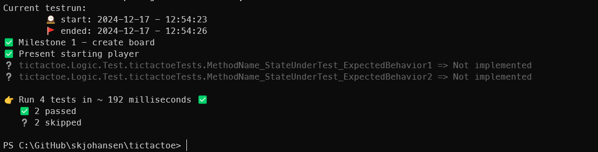
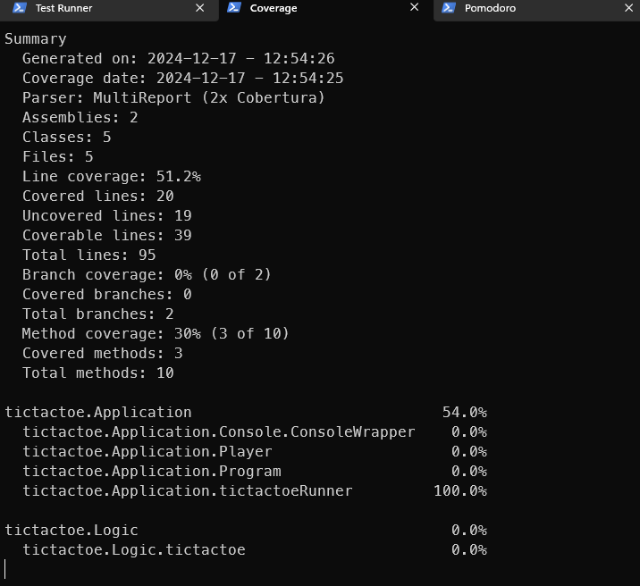
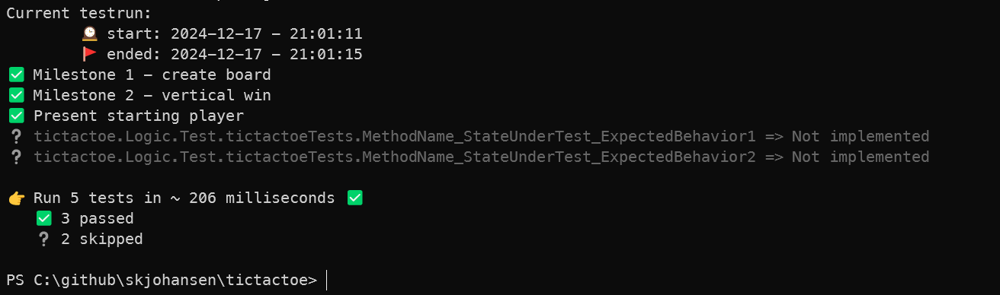
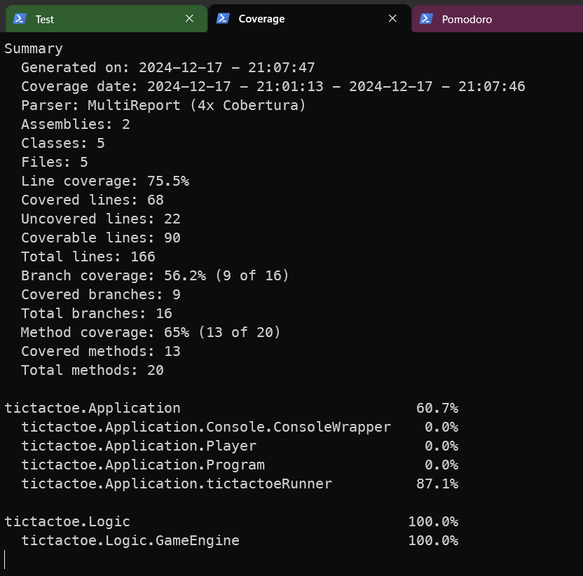

# Backlog - Stories and user acceptans criterias

* ⚠️ **WIP**  
* ✅ **GREEN**  
* 🧠 **In Discovery**  
* ❌ **RED**  
* 📝 **TBD**  

## milestone 1: Board creation and presentation

* ✅ printed board should be simple ascii on the console
* ✅ the player to start the game should be random X or O

## milestone 2: Vertical win
part 1:
* ✅ each player make a move
* ✅ annonuce winner

Part 2:
* if 3 equal on vertical set as winner

Part 3:
* bot players
* one move at the time with 2 sec pause between

## milestone 5: Draw

Part 1:
* end game when board is full
* draw is announced

